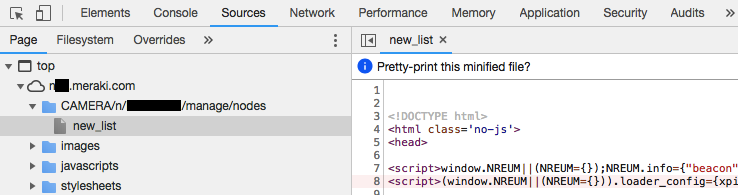

## DISCLAIMER
- This project was not built by Cisco Meraki and it is not in any way affiliated with Cisco Meraki
- I have done my best to test this code as much as possible, however use at your own risk

Cisco Meraki MV cameras use [HTTP Live Streaming (HLS)](https://en.wikipedia.org/wiki/HTTP_Live_Streaming) technology to playback video in a web browser.

## What is this and how does it work?
This is effectively an ffmpeg wrapper, allowing to store locally live video from Cisco Meraki MV cameras in an mp4 format. Video files from each camera are stored in separate directories, following the naming scheme `"#{camera_name.gsub(' ', '_')}_#{camera_serial.gsub('-', '')}"`, with file names being the epoch time in which they were created, format `"%Y%m%dT%H%M%S"`.

The Meraki dashboard API is used to pull the LAN IP address of the cameras in the organization. Reachability to the LAN IP address of the cameras, from the device where this is ran, is checked by running the curl command `curl --connect-timeout 2 --silent <LAN_IP>:443`. If the curl command does not succeed, the camera is deemed unreachable.

FFmpegWorker takes care of running and timing the ffmpeg processes that retrieve the video files and store them locally.

More information on the input arguments can be found in the [manpage](docs/manpage.txt).

## Getting started
This script requires:
- Meraki dashboard API key of an organization administrator, as the organization inventory has to be retrieved through the API
- *new_list* or *cameraKeys* file (more details on how to get those below)
- Ruby gems are listed in the Gemfile
	- `bundle install` can be used to install the relevant gems. automatically however results may vary depending on the OS you are using
- Ffmpeg, latest version for the platforms mentioned below should work

I have developed and tested this on:
- Mac OS (10.13+)
	- `ffmpeg version 4.1 Copyright (c) 2000-2018 the FFmpeg developers`
		`built with Apple LLVM version 10.0.0 (clang-1000.11.45.5)`
- Ubuntu 16.04+
	- 	`ffmpeg version 2.8.15-0ubuntu0.16.04.1 Copyright (c) 2000-2018 the FFmpeg developers`
		`built with gcc 5.4.0 (Ubuntu 5.4.0-6ubuntu1~16.04.10) 20160609`
- Raspberry Pi (4.14.71-v7+).
	- `ffmpeg version 3.2.10-1~deb9u1+rpt2 Copyright (c) 2000-2018 the FFmpeg developers`
		`built with gcc 6.3.0 (Raspbian 6.3.0-18+rpi1+deb9u1) 20170516`

## What is the *new_list* file and how is it relevant?
The *new_list* file contains references to the .m3u8 file inside the camera, which is used by ffmpeg to retrieve the .ts video fragments in the camera, as soon as they are stored.
To get the *new_list* file, navigate to the Camera > Cameras page with the Google Chrome Developer Tools open. Under the "Sources" section, there is a folder `<network_name>/n/<id>/manage/nodes` which will contain the *new_list* file. Store this file locally, and reference it using the argument *--newListFile \<file\>*.

## What is the *cameraKeys* file and how is it relevant?
If the *new_list* file is provided, via *--newListFile \<file\>*,  a *cameraKeys* file is automatically generated in the directory of the script, using the contents of the *new_list* file, which is essentially a CSV file used to build the .m3u8 URL that is fed to ffmpeg, which for second generation cameras will look like this: `https://<camera-LAN-IP>.<cameramac>.devices.meraki.direct/hls/high/high<cameraKey>.m3u8`

The *cameraKeys* file can be provided directly with *--cameraKeysFile \<file\>*, with a customised selection of cameras to monitor. The cameras referenced must be within the organization *orgID*, and the corresponding *cameraKey* value can be retrieved from the `m3u8_filename` key in each camera element of the `flux.actions.cameras.video_channels.reset` JSON array object inside the *new_file*. The *cameraKeys* file basically contains a list of:

> CAMERA-SERIAL-1,\<cameraKey_1\> 
> CAMERA-SERIAL-2,\<cameraKey_2\> 
> CAMERA-SERIAL-3,\<cameraKey_3\> 

## Limitations / Notes
- All the cameras, from which footage will be recorded, have to be within the same dashboard organization
	- If a cameraKeys file is not provided through *--cameraKeysFile*, cameras will have to be in the same network, as the *new_list* file will be processed
- The cameras are only reached on the local LAN, not through the cloud
- Preferrably, the cameras will be connected via Ethernet cable, not via WiFi
- The *--maxVideosPerCamera* argument does not account for existing directories/files associated with a camera
- I do not recommend running this while the video feed is open elsewhere, or using multiple instances of this script to monitor the same camera(s), as this will increase the load on the cameras and may cause unexpected outcomes
- There is a chance that ffmpeg processes will keep going after the MerakiFootageArchiver process is terminated
- Make sure the machine running this script has a stable network connection to the cameras. I have not yet accounted for ffmpeg losing connection to the camera :(

## Examples
- Record live video feed of the cameras extracted from the new_list file provided. Video files will be 1 hour long, i.e. 3600 seconds, and the next video file begin 30 seconds before the previous one ends, i.e. the last and first 30 seconds of the previous and next video file, respectively, will be the same.

`./MerakiArchiver.rb --orgID <ord_id> --apiKeyFile <api_key_file> --newListFile <new_list_file> --videoOutputDir <out_dir> --maxVideoLength 3600 --videoOverlap 30`

- Same as above, however only 10 videos per camera will be stored. If the limit is reached, the oldest video file will be removed.

`./MerakiArchiver.rb --orgID <ord_id> --apiKeyFile <api_key_file> --newListFile <new_list_file> --videoOutputDir <out_dir> --maxVideoLength 3600 --videoOverlap 30 --maxVideosPerCamera 10`

- Same as second example. List of cameras to be monitored is in the `camera_keys_file` and there is no need to provide a new_file. Allows any camera in that organization, not only in the network, to be recorded.

`./MerakiArchiver.rb --orgID <ord_id> --apiKeyFile <api_key_file> --cameraKeysFile <camera_keys_file> --videoOutputDir <out_dir> --maxVideoLength 3600 --videoOverlap 30 --maxVideosPerCamera 10`
